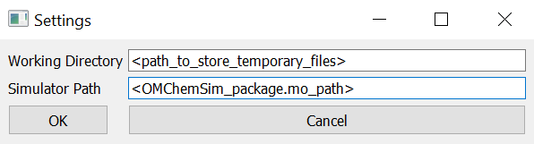
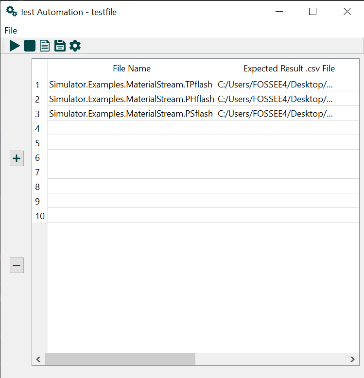

# OMChemSim-testing-automation

This tool is created for doing testing automation during the developement of OMChemSim.

When developers are implementing new feature in OMChemSim the testing automation can be run once to check if the new developement 
results are not breaking already working code by matching with the old results. This tool currently supports all examples available 
in OMChemSim.

# Use
* Run GUI.py

* Click on "Settings" button on the toolbar and enter a working directory path and a Simulator path

  
  
 * Enter the examples and the paths of old result's .csv files for comparison
 
    
  
 * Click on "Simulation" button on the toolbar
 
 * Check in the terminal if a simulation is completed. After a simulation gets completed, click on "Report" button to see the Report.
 
   
